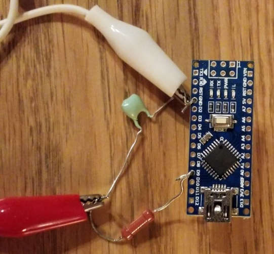

# The Machine That Goes *Ping*
A Cantus Firmus Generator for **atmega328p** (Arduino Nano)
## About the project
This is an exercise project for the microcontroller programming course held
during the summer semester of 2018 in the Physics Department of the Warsaw University. It
was developed and tested on *atmega 328p* chip incorporated on *Arduino Nano* board.
However, it can be easily ported to other hardware when appropriate
`hardware_XXX.h` header is provided.

*Cantus Firmus* (lat: "Firmed Song") is a general name for a melody composed
according to a set of rules consisting of passages and jumps. It was widely
used in the middle ages, usually as the basis for polyphonic improvisation.
Nowadays, it can be heard in sacral and monastic choral music.

The idea of the project is to create a generator of sinusoidal analog signal,
which will randomly change the pitch to create a melody similar to _Cantus
Firmus_. The only hardware requirement a mini jack socket connected to Arduino
Nano's *gnd* and *D9* pins and a low-pass filter to remove some artifact frequencies.
In this configuration, standard headphones can be used to listen to the melody.

The application configures two hardware timers to create the signal: first
one is used for *PWM*, which allows digital to analog conversion, the other one
is used to regularly update the output analog signal, so the sine function is "drawn". 
The third timer is used to change the output frequency randomly but according to some rules.

## Build guide
  1. Configure the toolchain. Open the `Makefile` and change the variables `CXX`,
`OBJCOPY`, `AVRDUDE` accordingly to your `avr` installation. *Important:* `avr-g++` compiler version has to support C++14.
  1. Execute:

  `make upload`

## Additional features
Additional features are provided for debugging purposes:
* Error modes (`upload_with_error_modes` target). Simple macros are used for
  debugging. When some forbidden state is reached (i.e. chunk of signal is
  requested for output before it's prepared), the device enters an _ERROR
  mode_. All interrupts are disabled, and main loop is stopped. The led on
  Arduino Nano board starts to flash regularly. Number of flashes in a sequence
  indicates the index of error state reached. This is disabled in default
  configuration for optimization.
* Test configuration (`test` and `test_with_error_modes` targets). Application
  can be run on any machine, with calls to hardware functions mocked by
  printing a log to stdout. Interrupts are not simulated yet in test
  configuration, so only the behavior of the main loop and initial
  configuration can be tested. This can be also used for unit tests, if the
  `main.cc` is edited accordingly.
